# Soon-Sulleng-Guide
기존 미슐랭 가이드 이름을 패러디한 프로젝트 명으로 '순천향대' + '미슐랭 가이드'의 합성어로 네이밍하였습니다.
미슐랭 가이드가 맛있는 음식점들을 소개해주는 것처럼 저희는 재학생 리뷰를 기반으로 하여 학교 주변의 맛있는 메뉴들을 소개해줄 수 있는 서비스를 만들고 싶었습니다.

  

## 💻 프로젝트 진행 배경 및 소개

평소 학교 주변의 맛있는 메뉴들을 알기 위해서는 '에브리타임'이라는 커뮤니티에서 선배들이 써놓은 맛집 리스트들을 올려놓은 게시물들을 통해서 알거나, 친한 선배들에게 전해 들어 알 수 있었습니다. 물론 타 포털사이트의 리뷰들을 통해 확인할 수도 있겠으나, 광고성 리뷰 같은 정확하지 않은 리뷰들이 존재할 뿐만 아니라, 몇몇 음식점이나 카페 같은 경우에는 리뷰가 별로 없어서 정확한 정보를 얻기 힘들었습니다.

특히, 학기 초 신입생들은 학교 주변의 맛집 정보를 얻기 어려워, 처음에는 체인점에만 의존하거나 만족도가 낮은 음식을 접하는 경우가 많았습니다. 또한, '에브리타임' 게시물들은 시간이 지나면 묻혀버리거나, 리스트의 정보가 오래되어 음식점이 문을 닫은 경우도 자주 발생했습니다.

그래서 이러한 정확하지 않은 정보 속에서, 학교에 최소 4년 동안 다니면서 쌓인 재학생들만의 맛있는 메뉴들을 알려줄 수 있는 앱을 만들어보기로 하였습니다. 이 앱을 통해 학교 주변 맛집 정보를 재학생들끼리 공유하고 축적하여, 신입생은 물론 재학생도 쉽게 맛집을 찾을 수 있는 환경을 만들고자 합니다.

특히 기존 리뷰 서비스들 처럼 맛집 단위로 리뷰를 제공하는 것이 아니라, 맛집들의 특정 메뉴를 타겟으로 하여 메뉴 위주의 리뷰 서비스를 제공하는 것을 목표로 합니다. 이를 통해 학생들의 시간과 비용을 절약하고, 학교 생활의 만족도를 높이는 데 기여할 것으로 예상합니다.

  

## 👋 팀원 소개 및 역할 소개

- **김인경** ([GitHub Profile](https://github.com/SummerToday))
    - 팀 리더 / 풀스택 개발 · 인프라 구축 및 배포
    - 주요 기여
      - Spring Boot 기반 백엔드 아키텍처 설계 및 API 구현
      - Flutter를 활용한 UI/UX 설계 및 구현  
      - AWS 아키텍처 설계 및 구성
      - AWS Cloud 환경 배포
      - 데이터베이스 설계 및 구축

- **이나형** ([GitHub Profile](https://github.com/Lee-nahyung))
    - 팀원 / 벡엔드 개발 및 데이터베이스 설계 
    - 주요 기여
      - Spring Boot 기반 백엔드 아키텍처 설계 및 API 구현
      - 데이터베이스 설계 및 구축
      - AWS 아키텍처 설계 및 구성

  

## 📌 주요 기술 스택

### Environment

### Devlopment

### Community

  

## 프로젝트 계획서
> 

  

## 요구사항 분석
> 

  

## WBS
> 

  

## IA
> 

  

## AWS 아키텍처 설계
> 

  

## ERD 설계
> 

  

## 🛠️ 주요 기능

- 구글 로그인 기능
  - 기존에 사용하던 구글 계정을 이용하여 로그인을 진행할 수 있습니다.

- 자동 로그인 기능
    - 한번 로그인 할 시 별도의 로그아웃 절차가 없을 시 이전에 로그인 했던 계정으로 자동으로 로그인이 진행됩니다.

- 리뷰 작성 기능
  - 식당과 카페의 메뉴에 관련한 리뷰를 사진을 포함하여 작성할 수 있습니다.

- 리뷰 찜 기능
  - 작성된 리뷰 중 원하는 리뷰를 저장할 수 있습니다. 

- 식당과 카페 별 리뷰 목록 조회 기능
  - 작성된 리뷰들을 식당과 카페 별로 확인할 수 있습니다.

- 리뷰 검색 기능
  - 작성된 리뷰들 중 원하는 키워드를 이용하여 검색할 수 있습니다.

  

## 🔎 프로젝트 주요 구현 내용

- SNS(구글 계정)과 연동하여 간편한 회원가입 및 로그인 기능 구현
  
- 구글 계정에 저장된 사용자의 이름과 이메일 정보를 활용한 사용자 인증 설계

- Google OAuth2.0를 활용하여 보안 강화 및 토큰 기반 인증 체계 구축

- Flutter를 활용한 반응형 앱 설계로 다양한 기기에서 최적화된 사용자 경험 제공

- AWS 클라우드 서버를 사용하여 높은 가용성과 무중단 서비스를 제공하며, 안정성과 확장성을 보장하는 서버 인프라 설계

  

## ✨ 프로젝트 주요 구현 결과

[초기 화면]
- SNS(구글) 계정을 통해 간편하게 시작할 수 있는 화면을 제공합니다.

  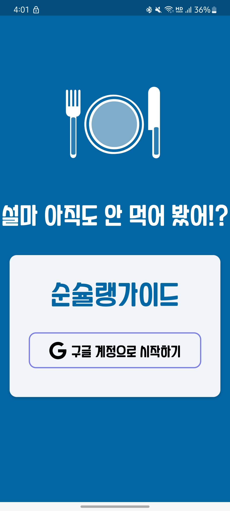

  
  

[로그인 화면]
- "구글 계정으로 시작하기" 버튼을 누르면 사용자가 원하는 구글 계정을 선택할 수 있는 선택 창이 표시됩니다.

  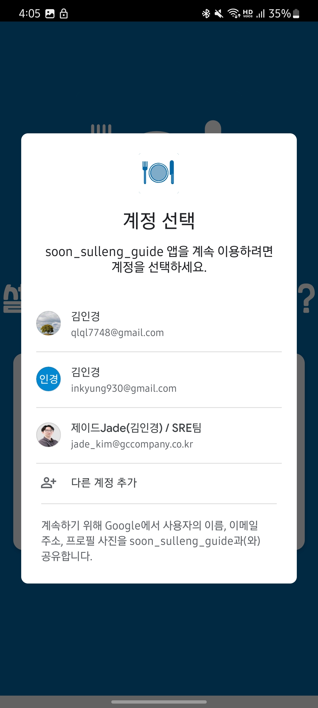

  

[닉네임 입력 화면]
- 최초 로그인하는 계정 같은 경우, 닉네임을 설정하는 화면이 나타나게 됩니다.

  

  

[메인 화면]
- 첫 접속 시, 사용자가 닉네임을 설정할 수 있는 창이 표시됩니다.
- 사용자가 작성한 음식점 및 카페에 대한 리뷰를 확인할 수 있습니다.
- 상단의 검색 아이콘을 눌러 특정 음식이나 가게에 대한 리뷰를 검색할 수 있습니다.
- 각 리뷰마다 별점을 확인할 수 있습니다.
- 리뷰들을 검색하고 검색 결과에 대한 항목 클릭 시 상세 정보를 확인할 수 있습니다.

  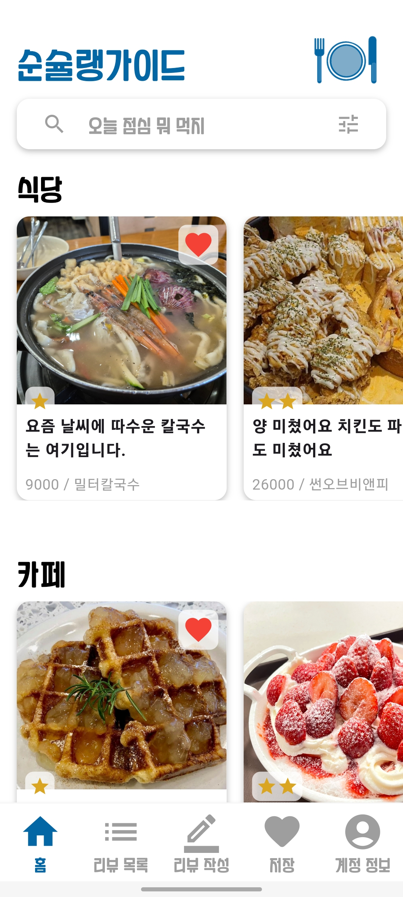
  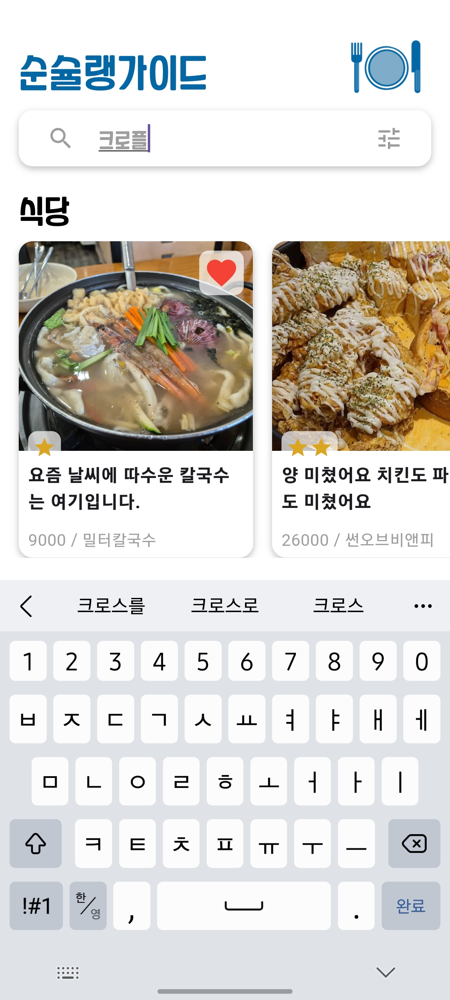
  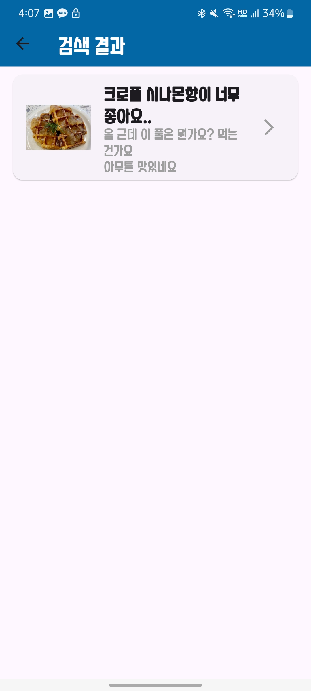

  

[상세 리뷰 페이지]
- 메인화면에서 리뷰를 클릭할 시 확인할 수 있는 창입니다.
- 상단의 리뷰사진을 클릭하여 사진을 크게 확인할 수 있습니다.
- 리뷰사진이 여러 개일 경우, 옆으로 넘겨 확인할 수 있습니다.

  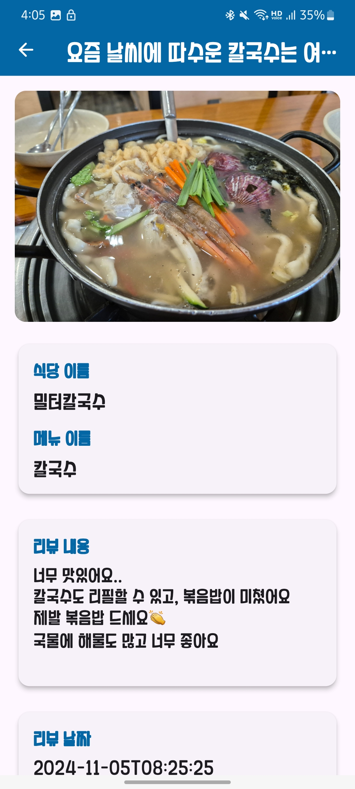
  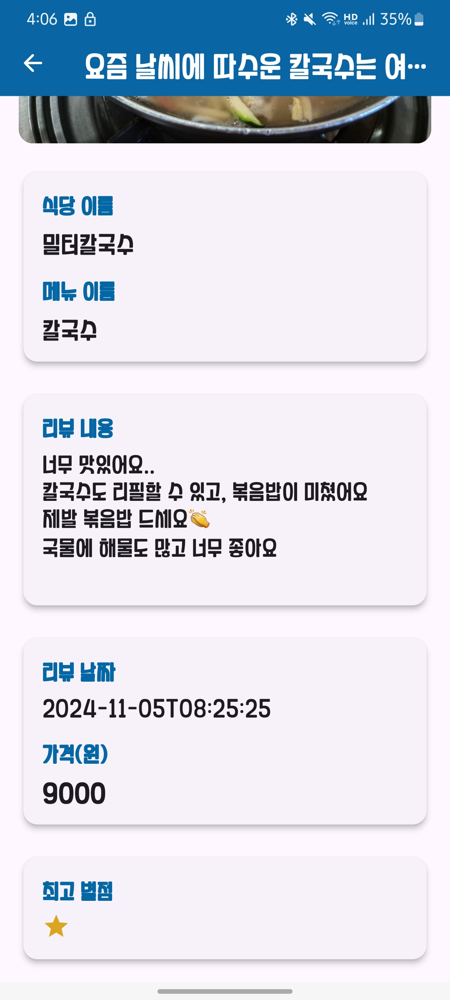

  

[전체 리뷰 목록]
- 작성된 전체 리뷰 목록을 볼 수 있습니다.

  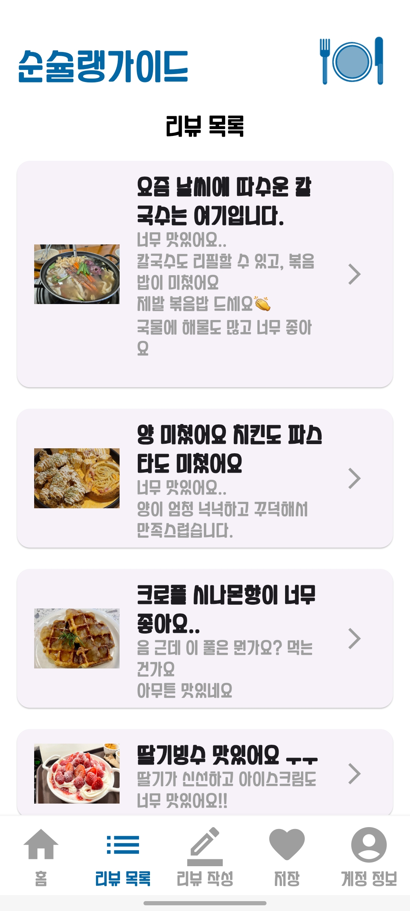

  

[리뷰 작성 페이지]
- 사용자가 리뷰를 작성할 수 있는 화면으로, 식당명, 리뷰 내용, 별점 등을 입력할 수 있습니다.
- 리뷰 작성 시 갤러리에서 여러 장의 사진을 첨부할 수 있도록 설계하였습니다.

  
  

  

[찜 목록 화면]
- 찜한 리뷰들의 목록을 확인할 수 있습니다.
- 휴지통 버튼을 클릭하여 각 찜한 리뷰들을 찜 해제할 수 있습니다.
- 찜한 리뷰 클릭 시 자세한 정보를 확인할 수 있습니다.

  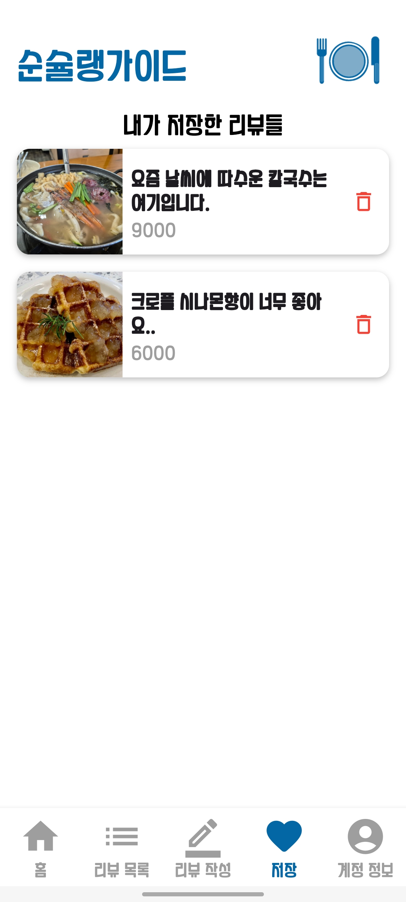
  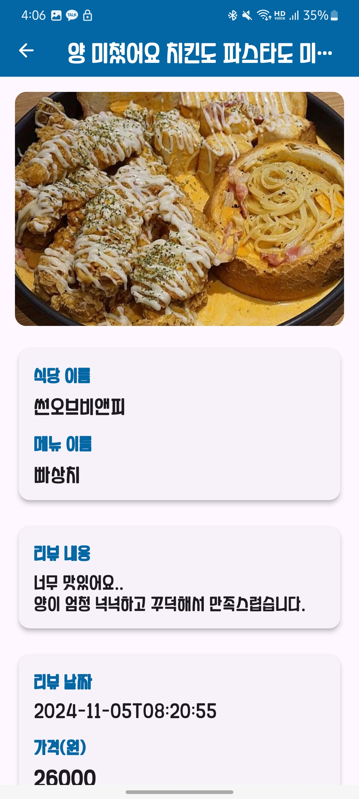
  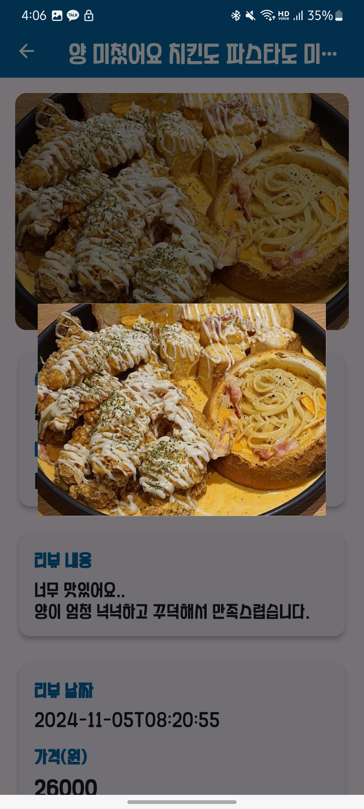

  

[계정 정보 화면]
- 사용자에 대한 간단한 정보들을 확인할 수 있습니다.
- 로그아웃 버튼을 통해 로그아웃을 할 수 있습니다.

  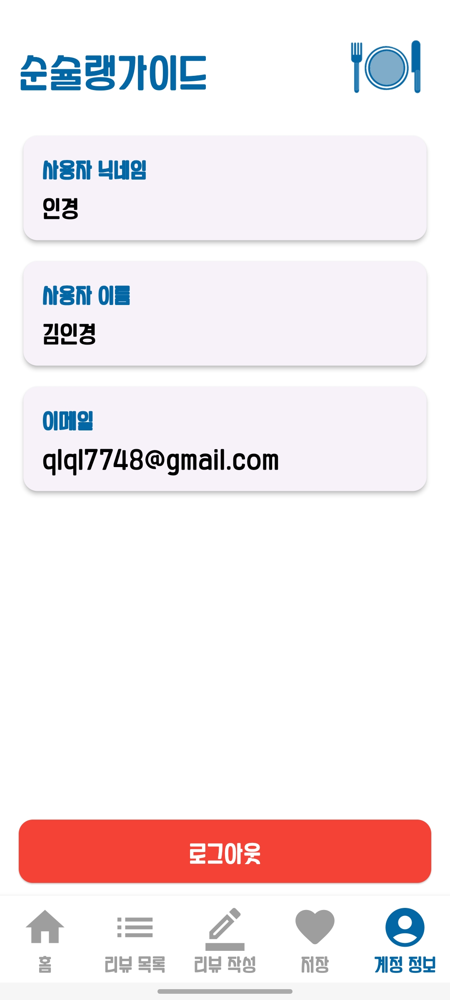

  

## 상세 프로젝트 리포지토리
### 벡엔드: https://github.com/SummerToday/Soon-Sulleng-Guide-App-Backend.git

### 프론트엔드: https://github.com/SummerToday/Soon-Sulleng-Guide-App.git

